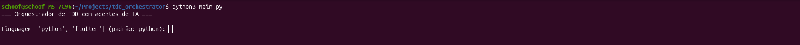
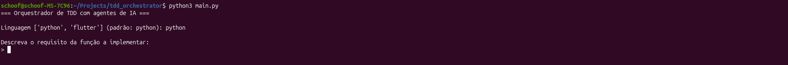
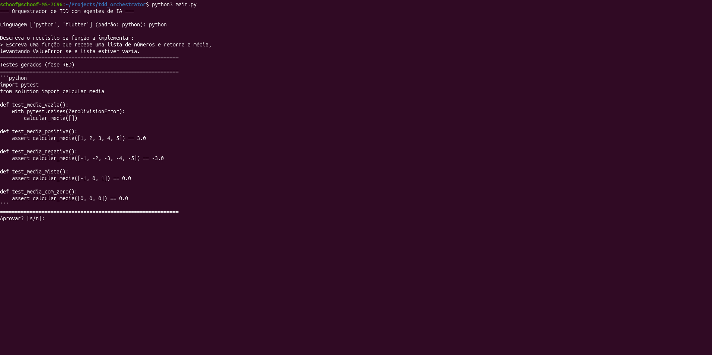
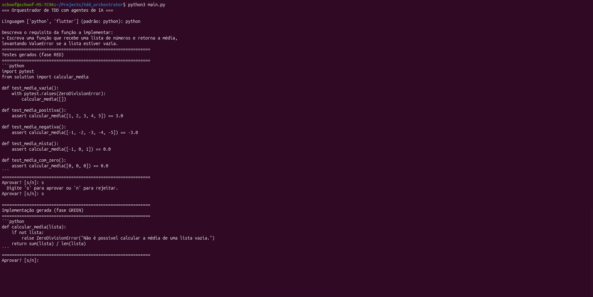
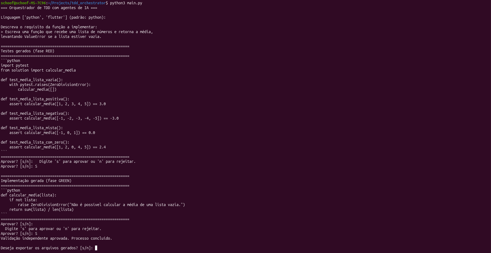
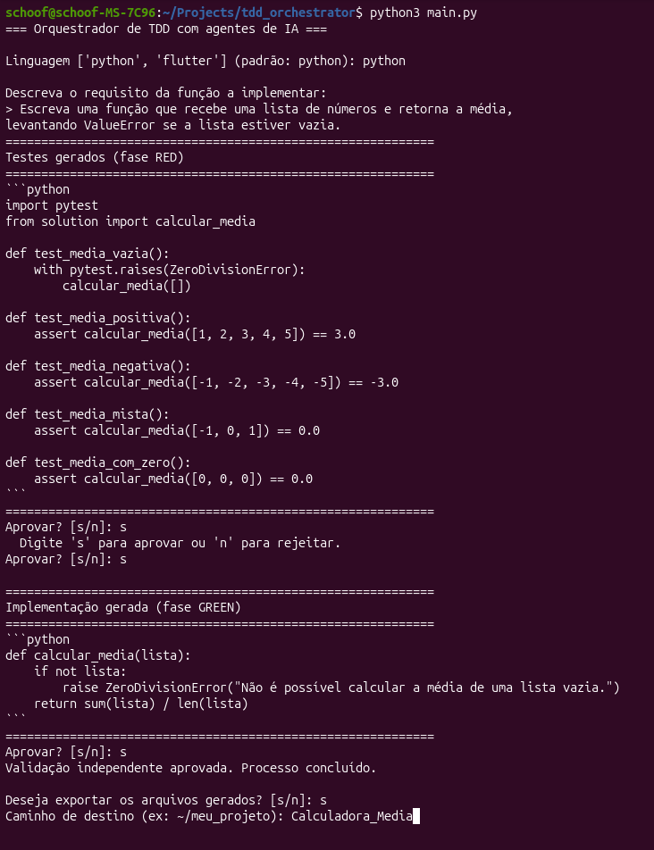
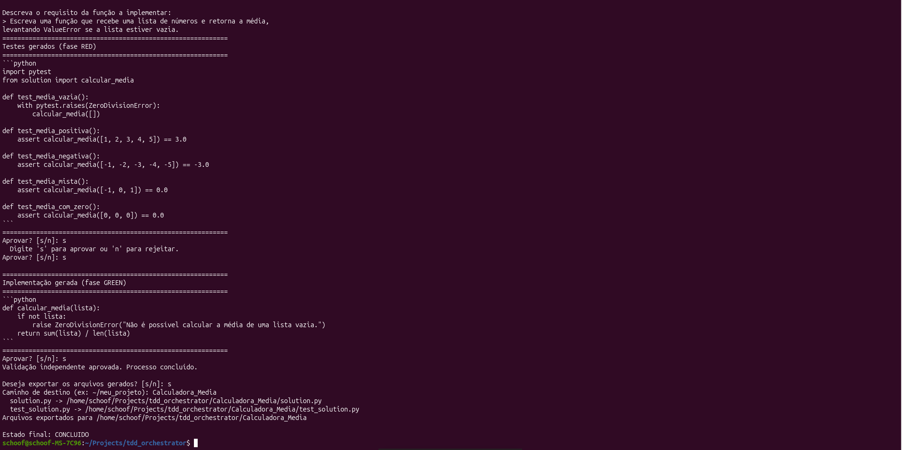

# Orquestrador de TDD com agentes de IA

Sistema que automatiza parte do ciclo de TDD (Test-Driven Development)
usando três agentes de IA especializados, rodando sobre um LLM local
(via [RamaLama](https://github.com/containers/ramalama)), com o humano
no controle de cada etapa.

## Por que três agentes, e não um só?

Se o mesmo agente escreve o teste e o código que passa nele, ele pode
"satisfazer" o teste de forma superficial sem resolver o problema real
— o equivalente a um aluno corrigir a própria prova. Por isso o papel de
validação é separado e **nunca tem acesso aos testes originais**, só ao
requisito em linguagem natural e ao código final. Isso simula um
processo de QA independente.

## Arquitetura

```
Humano define requisito
    -> Agente de Testes (RED)        gera testes que devem falhar
    -> [aprovação humana]
    -> Agente de Código (GREEN)      implementa até passar nos testes reais (pytest)
    -> [aprovação humana]
    -> Agente de Validação           cria testes NOVOS e independentes
    -> se reprovar, processo é encerrado (sem retry automático nesta fase)
```

Nenhuma transição de fase é decidida pela opinião do modelo — a fase
GREEN só avança quando o `pytest` real confirma que os testes passam,
e a aprovação humana é um checkpoint obrigatório, não uma sugestão.

## Estrutura de arquivos

| Arquivo | Responsabilidade |
|---|---|
| `llm_client.py` | Fala com a API local do RamaLama (compatível com OpenAI) |
| `agents.py` | Os três agentes: testes, código, validação |
| `test_runner.py` | Escreve arquivos e executa o pytest de verdade |
| `cli.py` | Checkpoint de aprovação humana via terminal |
| `orchestrator.py` | Máquina de estados que conecta tudo |
| `main.py` | Ponto de entrada |
| `prompts/` | System prompt de cada agente |
| `run_logger.py` | Registra cada tentativa em `workspace/run_log.jsonl` |
| `workspace/` | Onde os arquivos de teste, implementação e log são gerados |

## Como rodar

1. Subir o modelo local:
   ```bash
   ramalama serve gemma3:4b
   ```

2. Instalar dependências:
   ```bash
   python3 -m pip install -r requirements.txt --break-system-packages
   ```

3. Executar:
   ```bash
   python3 main.py
   ```

4. Descrever o requisito quando solicitado, por exemplo:
   ```
   Escreva uma função que recebe uma lista de números e retorna a média,
   levantando ValueError se a lista estiver vazia.
   ```

## Demo

Ciclo completo usando o exemplo da calculadora de média.

**Início — escolha de linguagem e entrada do requisito**





**Fase RED — Agente de Testes gera os testes e aguarda aprovação humana**



**Fase GREEN — Agente de Código implementa a solução e aguarda aprovação**



**Fase de Validação — Agente independente aprova o ciclo completo**



**Exportação dos arquivos gerados**



**Estado final: CONCLUIDO**



## Limitações conhecidas

- Só lida com uma função por vez (sem múltiplos arquivos/módulos).
- Não tem rollback automático de código entre tentativas (cada tentativa
  sobrescreve a anterior — para projeto maior, vale versionar com git).
- A aprovação humana é via terminal; uma evolução natural é uma interface
  web mostrando diff lado a lado.

## Roadmap

| Etapa | Descrição | Branch |
|---|---|---|
| 1 | Executor polimórfico (Python + Flutter) | `feature/executor-polimorfico` |
| 2 | Múltiplos arquivos e módulos | `feature/multiplos-arquivos` |
| 3 | Suporte Flutter completo | `feature/flutter` |

Previsão de conclusão: **18 de julho de 2026**. Detalhes em [ROADMAP.md](ROADMAP.md).
